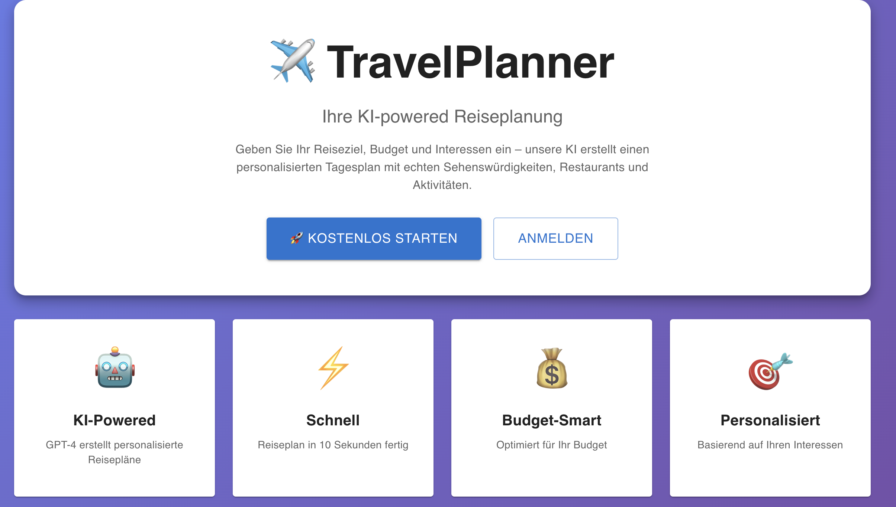
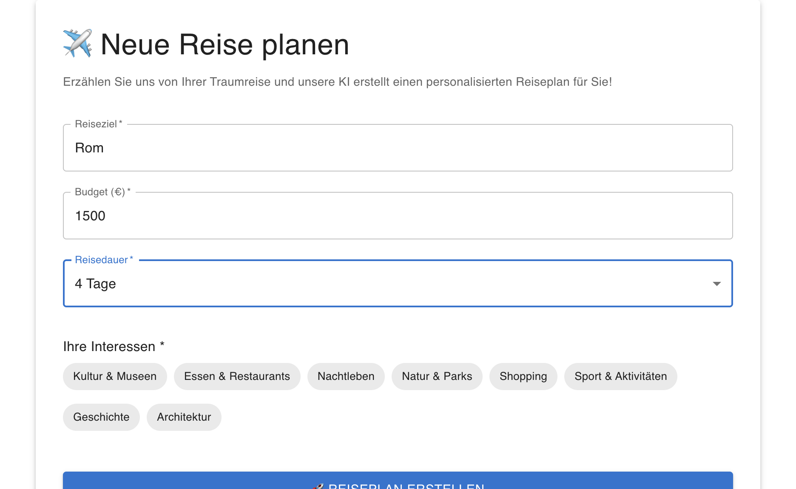
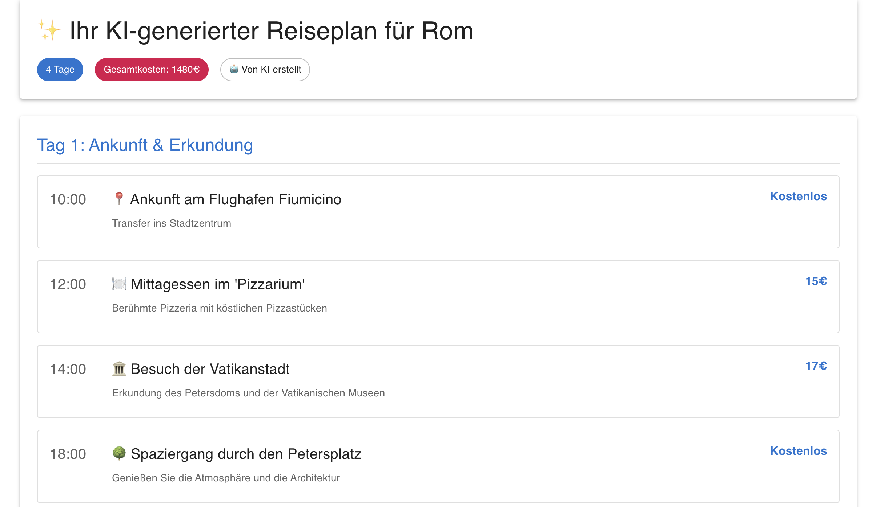
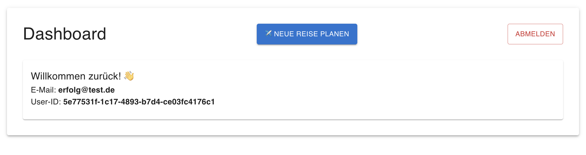

# ✈️ TravelPlanner - KI-powered Reiseplanung

> Personalisierte Reisepläne in Sekunden – powered by GPT-4

[](https://www.typescriptlang.org/)
[](https://reactjs.org/)
[](https://www.python.org/)
[](https://openai.com/)



## 🎯 Was ist TravelPlanner?

Eine Full-Stack Web-Anwendung, die künstliche Intelligenz nutzt, um personalisierte Reisepläne zu erstellen. Geben Sie Ihr Reiseziel, Budget, Reisedauer und Interessen ein – GPT-4 erstellt einen detaillierten Tagesplan mit echten Sehenswürdigkeiten, Restaurants und Aktivitäten.

### ✨ Features

- 🤖 **KI-powered Planning** - GPT-4 erstellt personalisierte Reisepläne
- ⚡ **Schnell** - Reiseplan in 10-15 Sekunden
- 💰 **Budget-optimiert** - Empfehlungen basierend auf Ihrem Budget
- 🎯 **Personalisiert** - 8 Interessen-Kategorien (Kultur, Essen, Natur, etc.)
- 🔐 **Sicher** - JWT-basierte Authentifizierung mit bcrypt
- 📱 **Responsive** - Funktioniert auf Desktop & Mobile

## 📸 Screenshots

### Trip Planner
Intuitives Formular zur Eingabe von Reisedaten und Interessen.



### AI-Generated Itinerary
Detaillierter Tagesplan mit echten Orten, Uhrzeiten und Kosten.



### User Dashboard
Persönliche Übersicht nach dem Login.



## 🏗️ Tech Stack

### Frontend
- **React** (TypeScript) - UI Framework
- **Material UI** - Component Library
- **React Router** - Navigation
- **Axios** - HTTP Client

### Backend
- **Node.js + Express** (TypeScript) - User Service
- **Python + FastAPI** - Planning Service mit OpenAI
- **PostgreSQL** - User & Session Management
- **Redis** - Caching
- **Prisma** - ORM
- **JWT** - Authentication

### Infrastructure
- **Docker** - Containerization
- **Docker Compose** - Multi-Container Setup

## 🚀 Quick Start

### Voraussetzungen
- Node.js 18+
- Python 3.9+
- Docker Desktop
- OpenAI API Key

### Installation

1. **Repository klonen**
```bash
cat > README.md << 'READMEEOF'
# ✈️ TravelPlanner - KI-powered Reiseplanung

> Personalisierte Reisepläne in Sekunden – powered by GPT-4

[](https://www.typescriptlang.org/)
[](https://reactjs.org/)
[](https://www.python.org/)
[](https://openai.com/)


## 🎯 Was ist TravelPlanner?

Eine Full-Stack Web-Anwendung, die künstliche Intelligenz nutzt, um personalisierte Reisepläne zu erstellen. Geben Sie Ihr Reiseziel, Budget, Reisedauer und Interessen ein – GPT-4 erstellt einen detaillierten Tagesplan mit echten Sehenswürdigkeiten, Restaurants und Aktivitäten.

### ✨ Features

- 🤖 **KI-powered Planning** - GPT-4 erstellt personalisierte Reisepläne
- ⚡ **Schnell** - Reiseplan in 10-15 Sekunden
- 💰 **Budget-optimiert** - Empfehlungen basierend auf Ihrem Budget
- 🎯 **Personalisiert** - 8 Interessen-Kategorien (Kultur, Essen, Natur, etc.)
- 🔐 **Sicher** - JWT-basierte Authentifizierung mit bcrypt
- 📱 **Responsive** - Funktioniert auf Desktop & Mobile

## 📸 Screenshots

### Trip Planner
Intuitives Formular zur Eingabe von Reisedaten und Interessen.


### AI-Generated Itinerary
Detaillierter Tagesplan mit echten Orten, Uhrzeiten und Kosten.


### User Dashboard
Persönliche Übersicht nach dem Login.


## 🏗️ Tech Stack

### Frontend
- **React** (TypeScript) - UI Framework
- **Material UI** - Component Library
- **React Router** - Navigation
- **Axios** - HTTP Client

### Backend
- **Node.js + Express** (TypeScript) - User Service
- **Python + FastAPI** - Planning Service mit OpenAI
- **PostgreSQL** - User & Session Management
- **Redis** - Caching
- **Prisma** - ORM
- **JWT** - Authentication

### Infrastructure
- **Docker** - Containerization
- **Docker Compose** - Multi-Container Setup

## 🚀 Quick Start

### Voraussetzungen
- Node.js 18+
- Python 3.9+
- Docker Desktop
- OpenAI API Key

### Installation

1. **Repository klonen**
```bash
git clone https://github.com/mariekewagner2302-lang/KI-Reise-App.git
cd KI-Reise-App
```

2. **Docker Container starten**
```bash
docker-compose up -d
```

3. **User Service starten**
```bash
cd services/user-service
npm install
npm run dev
```

4. **Planning Service starten**
```bash
cd services/planning-service
python3 -m venv venv
source venv/bin/activate
pip install fastapi uvicorn openai python-dotenv

# .env erstellen und OpenAI API Key eintragen
echo "OPENAI_API_KEY=your-key-here" > .env
echo "PORT=3002" >> .env
echo "ALLOWED_ORIGINS=http://localhost:3001" >> .env

uvicorn app.main:app --reload --port 3002
```

5. **Frontend starten**
```bash
cd web-app
npm install
npm start
```

6. **App öffnen**
```
http://localhost:3001
```

## 📁 Projekt-Struktur
```
KI-Reise-App/
├── services/
│   ├── user-service/          # Node.js Auth Backend
│   │   ├── src/
│   │   │   ├── index.ts       # Express Server
│   │   │   ├── routes/        # API Routes
│   │   │   └── middleware/    # JWT Auth
│   │   └── prisma/            # Database Schema
│   │
│   └── planning-service/      # Python AI Backend
│       ├── app/
│       │   ├── main.py        # FastAPI Server
│       │   ├── routes/        # Planning API
│       │   └── services/      # OpenAI Integration
│
├── web-app/                   # React Frontend
│   ├── src/
│   │   ├── pages/             # React Pages
│   │   ├── services/          # API Client
│   │   └── App.tsx            # Router
│   └── package.json
│
├── docs/
│   └── screenshots/           # App Screenshots
├── docker-compose.yml         # PostgreSQL + Redis
└── README.md
```

## 🔑 API Endpoints

### User Service (Port 3000)
- `POST /api/v1/auth/signup` - Registrierung
- `POST /api/v1/auth/login` - Login
- `GET /health` - Health Check

### Planning Service (Port 3002)
- `POST /api/v1/planning/generate` - KI-Reiseplan generieren
- `GET /health` - Health Check

## 💡 Verwendung

1. **Registrieren** - Account erstellen auf der Landing Page
2. **Einloggen** - Mit Email & Passwort anmelden
3. **Reise planen** - Ziel, Budget, Dauer & Interessen eingeben
4. **Warten** - KI erstellt Ihren Plan (10-15 Sek)
5. **Entdecken** - Personalisierten Tagesplan mit echten Orten anschauen

## 🔐 Sicherheit

- Passwörter mit **bcrypt** verschlüsselt (10 Runden)
- **JWT Tokens** für Session-Management
- **CORS** richtig konfiguriert
- **Environment Variables** für sensible Daten
- Session-Tracking in PostgreSQL

## 📊 Datenbank Schema

### User
- id (UUID)
- email (unique)
- passwordHash
- firstName, lastName
- tier (free/premium)
- createdAt

### Session
- id (UUID)
- userId (FK)
- accessToken
- refreshToken
- expiresAt

## 🌟 Features in Detail

### KI-Reiseplanung
- Nutzt OpenAI GPT-4o-mini für intelligente Empfehlungen
- Berücksichtigt Budget, Interessen und Reisedauer
- Generiert echte Sehenswürdigkeiten und Restaurants
- Kalkuliert realistische Kosten
- Erstellt Tagesplan mit Uhrzeiten

### User Experience
- Moderne, responsive UI mit Material UI
- Gradient-Design auf Landing Page
- Intuitive Formular-Validierung
- Loading States während KI-Generierung
- Error Handling mit hilfreichen Meldungen

## 🌟 Roadmap

- [ ] Trip-Speicherung in Datenbank
- [ ] Trip-Historie & Verwaltung
- [ ] PDF-Export von Reiseplänen
- [ ] Google Maps Integration
- [ ] Wetter-Integration
- [ ] Social Sharing

## 🤝 Contributing

Contributions sind willkommen! Bitte erstellen Sie einen Pull Request.

## 📝 License

MIT License

## 👨‍💻 Entwickelt von

**Marieke Wagner**

GitHub: [@mariekewagner2302-lang](https://github.com/mariekewagner2302-lang)

## 🙏 Credits

- OpenAI GPT-4 für KI-Reiseplanung
- Material UI für UI Components
- Prisma für Database ORM
- FastAPI für Python Backend
- React Team für Frontend Framework

---

**⭐ Wenn Ihnen dieses Projekt gefällt, geben Sie ihm einen Star auf GitHub!**

---

*Full-Stack AI Project entwickelt in 4 Tagen*
